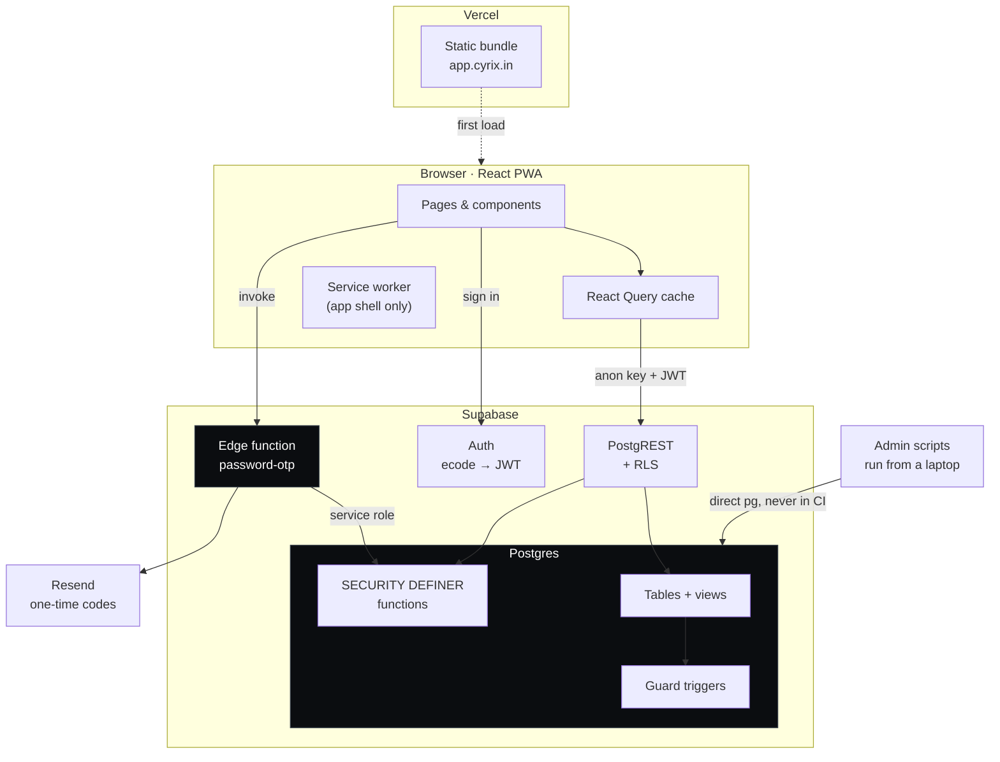
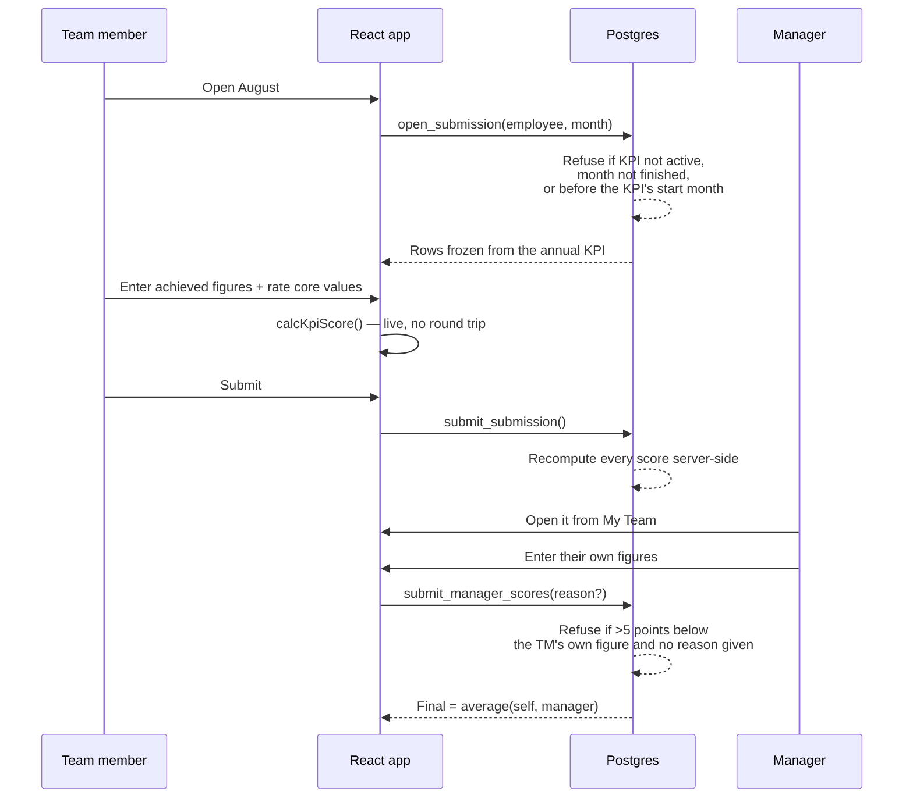
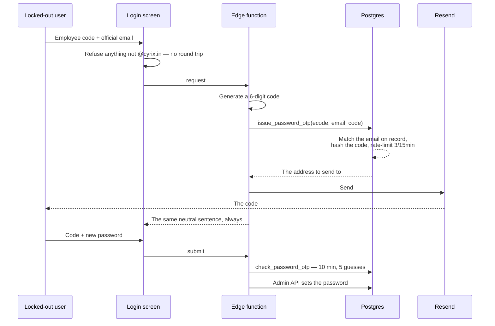

# Architecture

How Cyrix KPI is put together, and why. Read this before changing
anything structural; read [README.md](README.md) for how to run it.

---

## 1. Project overview

### Core vision

**1,148 people were being appraised out of a spreadsheet.**

One Excel file per person per month, emailed around, with formulas that
were quietly wrong — `SUM(D6:D6)` counted the first KRA and ignored the
rest, and `AVERAGE(G,K)` silently halved somebody's score whenever their
manager had not filled their column in yet. Nobody could see a team at a
glance, nobody could query a score they disagreed with, and the numbers
that fed appraisal and PIP decisions were whatever the last person to
open the file had left behind.

This replaces that file. A team member agrees a KPI once a year, fills in
what they achieved each month, their manager scores it, and the blended
result is the record. Every number is computed server-side from rules
stored as data.

### The vibe

**Phone-first, for a service floor.** Most people using this are field
engineers on Android, on patchy 4G, standing up. It is a PWA so it opens
from a home screen like an app. Every screen is built at 375px first and
widened, not the other way round.

**The database is the product.** The UI is a way to look at Postgres.
Scoring, permissions, workflow transitions and validation all live in SQL
because that is the only place they cannot be bypassed — a REST client
with the public key must not be able to do anything the UI forbids.

**Say the true thing plainly.** The app tells people what is actually
happening: which months are still theirs to do, why a score was cut, that
passwords cannot be displayed by anybody. Where a rule is enforced, the
screen says the rule.

**Nobody gets stranded.** Every recovery path has a fallback that does
not depend on the thing that just failed. That principle has earned its
keep repeatedly — see §7.

---

## 2. High-level architecture

### System summary

A static React bundle talks directly to Supabase over HTTPS. There is no
application server of our own.

- **The browser** holds a real signed JWT and queries Postgres through
  PostgREST. Row-Level Security decides what comes back, so the client
  can ask for anything and only ever receives its own rows.
- **Postgres** owns everything that matters: 24 tables, 11 views,
  67 functions, 40 RLS policies and 14 guard triggers. Business rules are
  `SECURITY DEFINER` functions the client calls as RPCs.
- **One edge function** exists, for the single job the browser must not
  do: generating and emailing a one-time password code.
- **Vercel** serves the bundle. **Resend** sends the mail.

### Diagram



**The boundary that matters** is the one around Postgres. Everything
inside it is trusted; everything outside is a client holding a key that
ships in the JavaScript. The anon key is public by design — it grants
nothing on its own, because RLS makes every request answer "who are
you?" first.

---

## 3. Tech stack

| Layer | Technology | Why |
| --- | --- | --- |
| Frontend | **React 18 + TypeScript + Vite** | Vite for a dev loop measured in milliseconds. TypeScript because the scoring maths is the product — a wrong number is worse than a crash, and `tsc` catches the shape errors that produce one. |
| Routing | **React Router 6** | Lazy-loaded routes so a service engineer signing in on 4G does not download the charting library or the Excel parser. |
| Server state | **TanStack Query** | Every screen is a view of the database. Query keys are the invalidation contract — `SUBMISSION_DEPENDENTS` in `queries.ts` lists what changes when a month is scored, in one place, because that badge kept showing work already done. |
| Backend / API | **Supabase (PostgREST + Auth)** | No server to write, deploy or keep patched. Rules live in the database instead, where the browser cannot route around them. |
| Business logic | **PL/pgSQL** | Scoring, workflow and validation are `SECURITY DEFINER` functions. The client asks; Postgres decides. |
| Database | **Postgres 17** | Real constraints, real transactions, RLS. Appraisal data needs a database that can refuse. |
| Serverless | **Supabase Edge Functions (Deno)** | Exactly one, `password-otp` — the only job needing a secret the browser must never hold. |
| Styling | **Tailwind CSS** | Utility classes keep the design decisions next to the markup. A small set of component classes (`.card`, `.input`, `.btn-primary`) live in `index.css` where repetition earned them. |
| Charts | **Recharts** | Composable, and lazy-loaded with the analysis screens. |
| Spreadsheets | **SheetJS (`xlsx`)** | KPIs arrive as Excel files, because that is what people have. Dynamically imported so it costs nothing until used. |
| Icons | **lucide-react** | Tree-shakeable, and tinted by meaning rather than decoration (`NAV_TINT` in `Shell.tsx`). |
| Mail | **Resend** | Sends from `send.cyrix.in`, a subdomain — deliberately not the root, whose SPF record already chains three senders and is near the 10-lookup limit that breaks company mail. |
| Testing | **Vitest** + SQL self-tests | 169 unit tests on the pure logic, and every migration ends in a `DO $$` block that fails the transaction if the change is wrong. |
| Hosting | **Vercel** | Static, global, auto-deploys on push. `vercel.json` carries the SPA rewrite, security headers and cache policy. |
| CI | **GitHub Actions** | Deploys edge functions on push. Migrations deliberately excluded — see §7. |

---

## 4. Directory structure

```
src/
  pages/          23 route components. One file per screen.
  components/     17 shared pieces — Shell, ChatBot, charts, prompts.
  lib/            All the logic worth testing. Pure where possible.
  contexts/       AuthContext (who you are), ScoreThemeContext (band colour).
  types/db.ts     Row shapes, mirroring the database.

supabase/
  migrations/     54 files. Numbered, immutable, self-testing.
  functions/      Edge functions. One so far.

scripts/          Admin tools run from a laptop, never from CI.
public/           Icons, manifest, service-worker notification handler.
```

### Where things live

**`src/lib/` is the important folder.** Anything with a rule in it moves
here and gets a test, because a rule inside a component can only be
verified by looking at it.

| File | Owns |
| --- | --- |
| `scoring.ts` | The scoring engine. A line-for-line mirror of `calc_kpi_score()` in SQL. |
| `bands.ts` | Poor → Excellent, the thresholds and every colour derived from them. |
| `queries.ts` | Every React Query hook and mutation. The only file that talks to Supabase. |
| `fy.ts` | Financial-year arithmetic. April–March, which nothing else assumes. |
| `chatbot.ts` | Question matching for the help panel. |
| `i18n.ts` + `help-strings.ts` | The manual in English, Malayalam, Hindi and Telugu. |
| `excel.ts` | Reading a KPI out of whatever shape of spreadsheet arrived. |

**`supabase/migrations/` is the source of truth.** Files are applied once
and checksummed by `scripts/apply-migrations.mjs`; editing an applied one
is an error. Each is a single transaction that ends in a self-test, so a
migration that would have been wrong never commits.

---

## 5. Key workflows

### A month, end to end



**The load-bearing detail:** the score shown while typing comes from
`src/lib/scoring.ts`, and the score that is stored comes from
`calc_kpi_score()` in SQL. Two implementations of the same arithmetic is
a drift risk, so `scoring.test.ts` and the self-test in each scoring
migration assert the same cases against both. They cannot disagree
without a test failing.

### Password reset

The one flow that leaves the database.



**Three deliberate choices in there.**

The code is generated in the edge function, because a code the browser
makes is a code the browser already knows. It is hashed by Postgres
beside the `crypt()` that verifies it, so one runtime owns the scheme.
And every answer to a stranger is the same sentence whether or not that
employee exists — a truthful "no such employee" on an anonymous form is
a way to find out who works here, and the codes are printed on badges.

---

## 6. Environment & configuration

**Only `VITE_`-prefixed variables reach the browser.** They are compiled
into the JavaScript anyone can read, which is fine for the two that
belong there and disqualifying for everything else.

### Frontend — set on Vercel

| Variable | Notes |
| --- | --- |
| `VITE_SUPABASE_URL` | The project URL. Public. |
| `VITE_SUPABASE_ANON_KEY` | The publishable key. Public by design; RLS is what protects the data. |
| `VITE_AUTH_EMAIL_DOMAIN` | Synthetic auth domain. Employee codes become `e1042@cyrix.local`, which never receives mail — it exists so Supabase Auth has an email to key on and we get real JWTs. |

### Edge function — set with `supabase secrets set`

| Variable | Notes |
| --- | --- |
| `RESEND_API_KEY` | Never a `VITE_` variable, never committed. |
| `OTP_FROM` | Fallback only. The live value is an `app_settings` row SW Admin can change without a redeploy. |

`SUPABASE_URL`, `SUPABASE_ANON_KEY` and `SUPABASE_SERVICE_ROLE_KEY` are
injected by the platform.

### Local only — `.env.local`, gitignored

| Variable | Notes |
| --- | --- |
| `SUPABASE_DB_URL` | Direct Postgres connection, carrying the database password. Used by `scripts/`. **Never** in CI, on Vercel, or in a commit. |
| `SUPABASE_SERVICE_KEY` | For the user-admin scripts. Same rule. |

---

## 7. Debt & scaling

Written honestly. Some of these have already cost a day.

### Verification has a hole in the middle

169 unit tests cover the pure logic and every migration self-tests, but
there are **no end-to-end tests and no component tests** — Vitest runs in
Node with no DOM. Components have been verified by rendering them in
throwaway harnesses and reading the DOM, which works and does not
persist.

*The gap this leaves:* every bug in this project that reached a
screenshot was in the wiring between tested pieces. Playwright against a
seeded project is the fix.

### `localStorage` is doing load-bearing work

Language, alert preference, PWA snooze and "has read the manual" all
live in the browser. It is per-origin, so **moving the app to
`app.cyrix.in` erased all of it for 1,148 people at once** — everyone was
signed out and the manual card reappeared for the whole company.

*Already mitigated:* the "are you new" question now comes from the
database (`manualOffer()` in `seenHelp.ts`) and the browser flag can only
ever hide the card early. The rest is genuinely disposable. Anything that
must survive belongs in a `user_preferences` table.

### The bulk employee import is a loaded gun

`AdminEmployees` upserts the **whole person** and stamps
`is_active: true` and `must_change_password: true` on every row it
touches. A two-column sheet fed to it would blank names, departments and
locations, reactivate leavers, and force a password change company-wide.
It only failed safe by accident — it drops rows with no name, so a
partial sheet imports nothing.

*Worked around, not fixed:* `scripts/import-emails.mjs` reads two columns
and writes one. The admin screen still needs splitting into "create
people" and "update these fields".

### The chatbot matches words, not meaning

`chatbot.ts` scores token overlap against the manual and a table of
aliases. No model, deliberately — see the file header — but it means a
question phrased unusually gets "I do not know that one". Every wrong
answer so far has been fixed by adding an alias, which does not scale
past a few dozen.

*If it needs to be smarter:* embeddings over the same manual, still
retrieval-only. The rule that must survive any change is that it never
answers an appraisal question by prediction.

### The translations are unreviewed

Malayalam, Hindi and Telugu were written without a native speaker. They
are deliberately literal, and the four languages sit on adjacent lines in
`help-strings.ts` and `chat-strings.ts` so somebody who reads one can
correct it against the English above it. A test enforces that system
words (KPI, Job Role, band names) survive translation untouched.

### One environment

There is no staging. Migrations are applied by hand from a laptop against
production, which is *why* each one self-tests and why they are excluded
from CI — automating them would need the database password in a CI secret
and would run schema changes the moment somebody merged.

*Trade accepted for now.* The self-tests have caught real errors more
than once. A second Supabase project is the honest fix.

### No observability

No error tracking, no performance monitoring. When something fails for
one person on one phone, the only evidence is a screenshot. Sentry is
half a day's work and would have shortened several of the debugging
sessions in this repo's history.

### Scale

At 1,148 employees and 84 submissions, nothing is under strain. The two
things that will bend first:

- **PostgREST's 1,000-row cap.** `SwAdmin` already pages around it
  explicitly. Any new query returning every employee needs the same
  treatment or it will silently truncate.
- **Annual growth.** Submissions grow at roughly 1,148 × 12 a year. The
  reporting views are unindexed against that; they will want covering
  indexes on `(employee_id, financial_year, period_month)` long before
  the row count is interesting.

---

## Principles worth keeping

If you change one thing about how this is built, do not change these.

1. **The database refuses, not the UI.** Every rule enforceable in SQL is
   enforced in SQL. The screen explains it; Postgres imposes it.
2. **Migrations are immutable and self-testing.** A migration that could
   be wrong ends in a `DO $$` block that proves it is not.
3. **Two engines, one answer.** The TypeScript scoring mirror exists for
   responsiveness only. Tests assert it agrees with SQL, always.
4. **Nothing that must not be public gets a `VITE_` prefix.**
5. **No recovery path may depend on the thing that failed.** Somebody
   with no email can still be let back in by HR; a forced password change
   never asks for a code; a failed send does not spend a rate-limit
   attempt.
